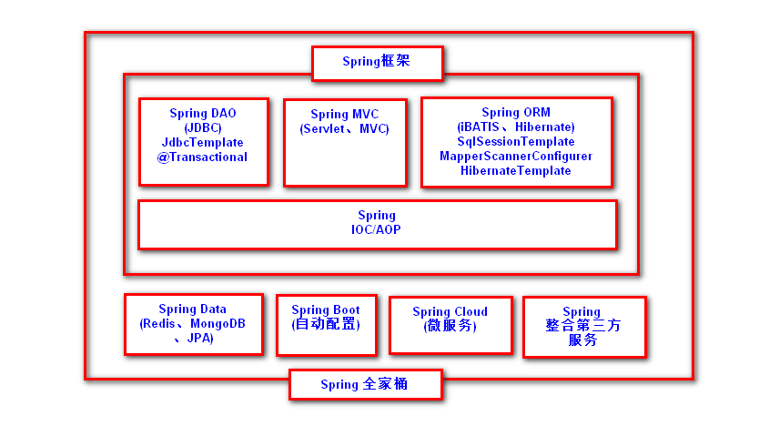
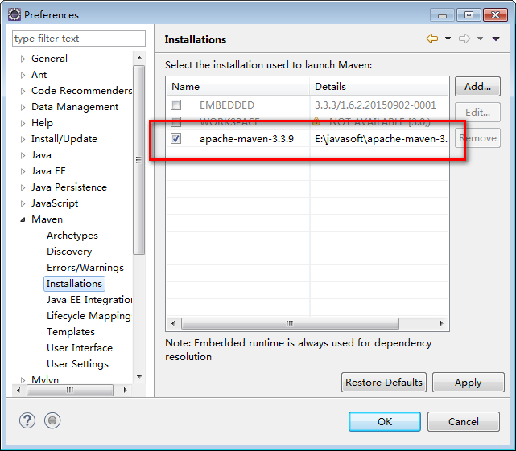
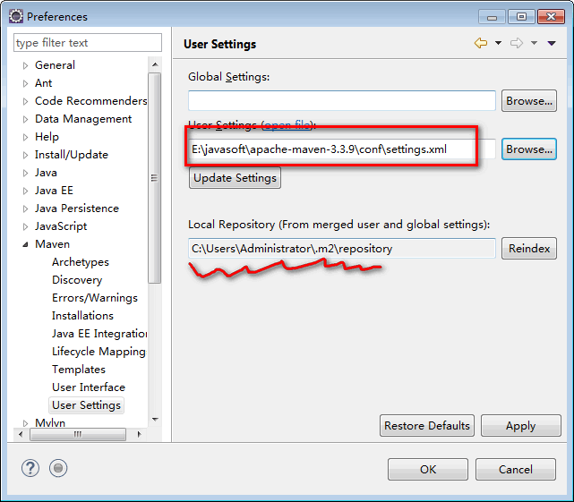
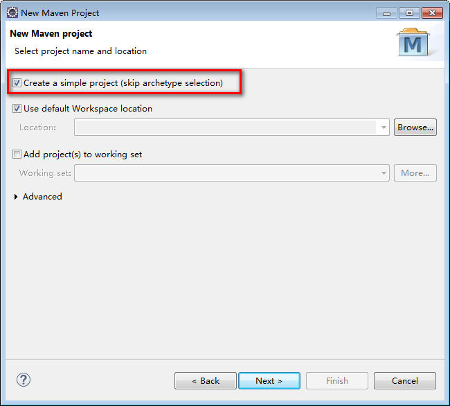
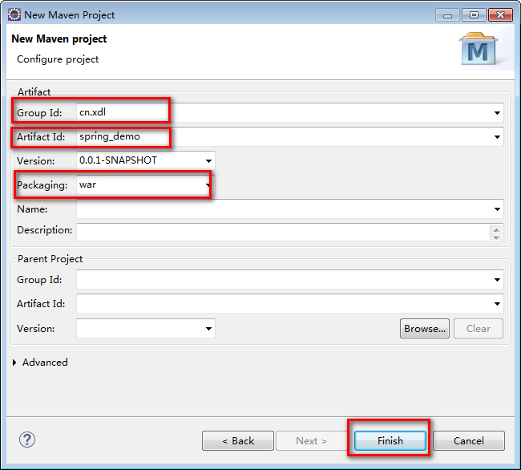
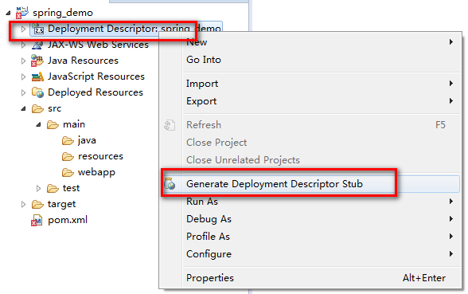
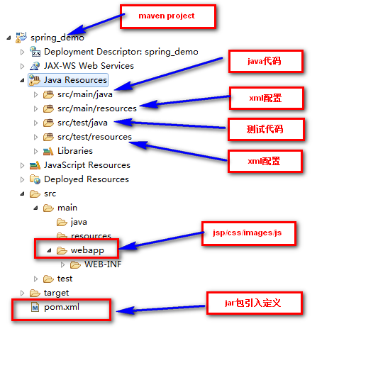

# SpringBoot框架

SpringBoot主要用于快速开发Spring应用程序。特点如下：

- SpringBoot就对Spring框架做了封装
- SpringBoot内置Tomcat服务器，启动时会自动将程序发布到Tomcat服务器
- SpringBoot具有自动配置功能，去除了XML配置，完全采用Java配置（注解）
- SpringBoot内置自动创建很多对象，例如连接池\JdbcTemplate\DispatcherServlet等，需要使用可以直接注入应用
- SpringBoot提供了一系列的工具包集合，便于开发引入

		基础包：spring-boot-starter-parent
		IOC包：spring-boot-starter
		MVC：spring-boot-starter-web
		DAO：spring-boot-starter-jdbc
		AOP：spring-boot-starter-aop
		mybatis: mybatis-spring-boot-starter

# MAVEN安装和使用

## 简介
MAVEN是用于项目构建的工具，参与项目创建、代码编译、jar包管理、创建发布包等一系列过程。

MAVEN目的：一种标准化的方式构建项目，一个清晰的方式定义项目的组成，一个容易的方式发布项目的信息，以及一种简单的方式在多个项目中共享JARs。

## maven安装

1. 下载maven工具包

	- 下载后解压，然后配置系统PATH环境变量
	- 之后打开cmd命令窗口，执行mvc命令

			mvn archetype:generate 创建Maven项目
			mvn compile 编译源代码
			mvn deploy 发布项目
			mvn test-compile 编译测试源代码
			mvn test 运行应用程序中的单元测试
			mvn site 生成项目相关信息的网站
			mvn clean 清除项目目录中的生成结果
			mvn package 根据项目生成的jar
			mvn install 在本地Repository中安装jar
			mvntomcat:run 启动tomcat服务

2. 在eclipse中配置maven工具

	

	

## maven使用

1. 设计案例流程

	/hello.do-->DispatcherServlet-->HandlerMapping-->HelloController-->@ResponseBody(gson)-->{"msg":"你好"}

2. 在pom.xml添加jar包定义

		<dependencies>
			<!-- springmvc -->
			<dependency>
			  <groupId>org.springframework</groupId>
			  <artifactId>spring-webmvc</artifactId>
			  <version>4.1.6.RELEASE</version>
			</dependency>
		
			<!-- gson -->
			<dependency>
			  <groupId>com.google.code.gson</groupId>
			  <artifactId>Gson</artifactId>
			  <version>2.5</version>
			</dependency>
		</dependencies>

3. 编写HelloController

		@Controller
		public class HelloController {
			
			@RequestMapping("/hello.do")
			@ResponseBody
			public Map<String, Object> execute(){
				Map<String, Object> data = new HashMap<String, Object>();
				data.put("msg", "你好");
				return data;
			}
			
		}

4. 流程配置

	- 配置DispatcherServlet

			<servlet>
				<servlet-name>springmvc</servlet-name>
				<servlet-class>
				org.springframework.web.servlet.DispatcherServlet
				</servlet-class>
				<init-param>
					<param-name>contextConfigLocation</param-name>
					<param-value>classpath:applicationContext.xml</param-value>
				</init-param>
			</servlet>
			
			<servlet-mapping>
				<servlet-name>springmvc</servlet-name>
				<url-pattern>*.do</url-pattern>
			</servlet-mapping>

	- 配置HandlerMapping
	
			<mvc:annotation-driven/>

	- 配置Controller

			<context:component-scan base-package="cn.xdl"/>

	
## SpringBoot实现Hello案例

1. 创建maven project，在pom.xml添加boot包

		<parent>
		  <groupId>org.springframework.boot</groupId>
		  <artifactId>spring-boot-starter-parent</artifactId>
		  <version>1.4.7.RELEASE</version>
		</parent>
		
		<dependencies>
			<dependency>
				 <groupId>org.springframework.boot</groupId>
		 		 <artifactId>spring-boot-starter-web</artifactId>
			</dependency>
		</dependencies>

2. 编写HelloController

		@RestController //等价于@Controller+@ResponseBody
		public class HelloController {
		
			@RequestMapping("/hello.do")
			public Map<String,Object> execute(){
				Map<String,Object> data = new HashMap<String, Object>();
				data.put("msg", "Hello Boot");
				return data;
			}
			
		}

3. 编写启动Boot应用的类

		@SpringBootApplication
		public class BootApplication {
			
			public static void main(String[] args) {
				SpringApplication.run(BootApplication.class, args);
			}
		}

4. 修改tomcat端口号和请求项目名(application.properties)

		server.port=8888
		server.context-path=/boot

## SpringBoot工程搭建

1. 工程jar包引入(pom.xml)

		<parent>
		  <groupId>org.springframework.boot</groupId>
		  <artifactId>spring-boot-starter-parent</artifactId>
		  <version>1.4.7.RELEASE</version>
		</parent>

	后续根据需要导入boot其他jar包工具集。

2. 配置文件

	- application.properties

			server.port=8888
			server.contextPath=/boot

	- application.yml

			server:
			 port: 8888
			 contextPath: /boot

3. 启动类（放在根包下，这样能最大范围的扫描）

		@SpringBootApplication
		public class BootApplication {
			
			public static void main(String[] args) {
				SpringApplication.run(BootApplication.class, args);
			}
		}

## @SpringBootApplication

@SpringBootApplication标记是一个集合，包含以下元素

1. @SpringBootConfiguration-->@Configuration-->@Component

	组件配置：程序员可以手动将组件对象配置到Spring容器。

		@Configuration//<beans>
		public class DataSourceConfig {
			
			//<bean id="xxx" class="xxxx">
			@Bean//将返回的ds对象放入Spring容器,id名为方法名createMyDataSource
			public MyDataSource createMyDataSource(){
				MyDataSource ds = new MyDataSource();
				return ds;
			}
	
			//<bean id="xxx" class="xxxx">
			@Bean("mydatasource")//将返回的ds对象放入Spring容器,id名为mydatasource
			public MyDataSource createMyDataSource1(){
				MyDataSource ds = new MyDataSource();
				return ds;
			}

		}
	

2. @EnableAutoConfiguration

	自动配置：自动加载组件并创建组件对象到Spring容器。

3. @ComponentScan

	组件扫描：将指定目录下的带标记的组件纳入到Spring容器。（@Controller、@Service、@Component、@Respository）

		//@ComponentScan(basePackages={"cn.xdl.dao"})
		@ComponentScan//默认当前包及其子包组件
		public class MyBootApplication {
		
		}

	根据MyBootApplication创建Spring容器

		public static void main(String[] args) {
			ApplicationContext ac = 
				SpringApplication.run(MyBootApplication.class);//@Configuration+@Bean
			DeptDao deptDao = ac.getBean("deptDao",DeptDao.class);
			deptDao.save();
			DataSource dbcp = ac.getBean("dbcp",DataSource.class);
			System.out.println(dbcp);
		}
