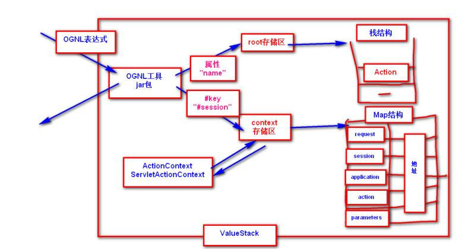

<h2>Struts2拦截器</h2>

Struts2框架提供大量内置拦截器，开发者也可以自定义。

<h3>拦截器规则</h3>

<ol>
<li>

编写规则，组件实现Interceptor接口及其约定方法

</li>
<li>

配置规则

定义规则

<pre><code>&lt;package&gt;
    &lt;interceptors&gt;
        &lt;interceptor name=&quot;别名&quot; class=&quot;实现类&quot;/&gt;
    &lt;/interceptors&gt;
&lt;/package&gt;
</code></pre>

使用规则

<pre><code>&lt;action name=&quot;...&quot; class=&quot;...&quot;&gt;
    &lt;interceptor-ref name=&quot;别名&quot;/&gt;
    &lt;result&gt;&lt;/result&gt;
&lt;/action&gt;

//指定包中所有action执行时要调用的拦截器
&lt;default-interceptor-ref name=&quot;别名&quot;/&gt;
</code></pre>

</li>
</ol>
<h2>Struts2的Result</h2>
<h3>Result原理</h3>
<pre><code>编写Result组件，实现Result接口及其方法。

在&lt;package&gt;中添加&lt;result-types&gt;配置。
</code></pre>

<h3>常用Result组件</h3>
<ol>
<li>

JSP响应

<ul>
<li>

dispatcher

<pre><code>&lt;result name=&quot;&quot; type=&quot;dispatcher&quot;&gt;
    /hello.jsp
&lt;/result&gt;
</code></pre>

</li>
<li>

redirect

<pre><code>&lt;result name=&quot;&quot; type=&quot;redirect&quot;&gt;
    /hello.jsp
&lt;/result&gt;
</code></pre>

</li>
</ul>
</li>
<li>

调下一个Action

请求--&gt;Action1----&gt;Action2--&gt;xxx

<ul>
<li>

redirectAction(重定向方式)

<pre><code>&lt;result name=&quot;nologin&quot; type=&quot;redirectAction&quot;&gt;
    &lt;param name=&quot;actionName&quot;&gt;tologin&lt;/param&gt;
    &lt;param name=&quot;namespace&quot;&gt;/user&lt;/param&gt;
&lt;/result&gt;
</code></pre>

</li>
<li>

chain(转发方式)

<pre><code>&lt;result name=&quot;nologin&quot; type=&quot;chain&quot;&gt;
    &lt;param name=&quot;actionName&quot;&gt;tologin&lt;/param&gt;
    &lt;param name=&quot;namespace&quot;&gt;/user&lt;/param&gt;
&lt;/result&gt;
</code></pre>

</li>
</ul>
</li>
<li>

json响应

需要引入struts2-json-plugin.jar包，extends继承json-default

<pre><code>&lt;dependency&gt;
    &lt;groupId&gt;org.apache.struts&lt;/groupId&gt;
    &lt;artifactId&gt;struts2-json-plugin&lt;/artifactId&gt;
    &lt;version&gt;2.5.14.1&lt;/version&gt;
&lt;/dependency&gt;
</code></pre>

将Action中所有属性以json方式输出

<pre><code>&lt;result name=&quot;&quot; type=&quot;json&quot;&gt;
&lt;/result&gt;
</code></pre>

将Action中某一个属性以json方式输出

<pre><code>&lt;result name=&quot;&quot; type=&quot;json&quot;&gt;
    &lt;param name=&quot;root&quot;&gt;属性名&lt;/param&gt;
&lt;/result&gt;
</code></pre>

将Action中多个属性以json方式输出

<pre><code>&lt;result name=&quot;&quot; type=&quot;json&quot;&gt;
    &lt;param name=&quot;includeProperties&quot;&gt;属性名,属性名&lt;/param&gt;
&lt;/result&gt;
</code></pre>

</li>
</ol>
<h2>Struts2的注解配置</h2>
<pre><code>@Action、@Result、@InterceptorRef、@ParentPackage、@Namespace
</code></pre>

<ol>
<li>

需要引入struts2-convention-plugin.jar包

<pre><code>&lt;dependency&gt;
  &lt;groupId&gt;org.apache.struts&lt;/groupId&gt;
  &lt;artifactId&gt;struts2-convention-plugin&lt;/artifactId&gt;
  &lt;version&gt;2.5.14.1&lt;/version&gt;
&lt;/dependency&gt;
</code></pre>

</li>
<li>

编写Action组件，应用注解定义

<pre><code>@ParentPackage(&quot;json-default&quot;)//extends=&quot;struts-default&quot;
@Namespace(&quot;/annotation&quot;)//namespace=&quot;/annotation&quot;
//@InterceptorRef(value=&quot;check&quot;)
public class DemoAction {

    private String msg;

    @Action(value=&quot;demo1&quot;,results={
        @Result(name=&quot;success&quot;,type=&quot;dispatcher&quot;,location=&quot;/WEB-INF/hello.jsp&quot;)//&lt;result name=&quot;&quot; type=&quot;&quot;&gt;
    })//&lt;action name=&quot;demo1&quot;&gt;
    public String execute(){
        msg = &quot;Struts2注解配置&quot;;
        System.out.println(&quot;执行了DemoAction处理&quot;);
        return &quot;success&quot;;
    }

    @Action(value=&quot;demo2&quot;,results={
        @Result(name=&quot;success&quot;,type=&quot;json&quot;,params={&quot;root&quot;,&quot;msg&quot;})
    })
    public String someService(){
        msg = &quot;json信息&quot;;
        return &quot;success&quot;;
    }

    public String getMsg() {
        return msg;
    }

    public void setMsg(String msg) {
        this.msg = msg;
    }

}
</code></pre>

注意：Action组件放在action包名中，类命名带有XxxAction.

</li>
</ol>
<h2>ValueStack值栈</h2>
<ol>
<li>

作用

可以存储值，一个请求进入Struts2框架，跟请求处理相关的上下文对象都在ValueStack中存储。例如request、action、session、application、parameters等。

</li>
<li>

OGNL工具

底层采用OGNL工具对ValueStack信息做存取操作。

Ognl.getValue(&quot;OGNL表达式&quot;,context存储区,action对象)
Ognl.setValue(&quot;OGNL表达式&quot;,context存储区,action对象,&quot;值&quot;)

</li>
<li>

在JSP中使用EL表达式取出Action对象属性值?

JSP原理：${msg}--&gt;request.getAttribute(&quot;msg&quot;)--&gt;session.getAttribute(&quot;msg&quot;)--&gt;application.getAttribute(&quot;msg&quot;)

Struts原理：${msg}--&gt;request.getAttribute(&quot;msg&quot;)--&gt;Ognl.getValue(&quot;msg&quot;,context,action)--&gt;session.getAttribute(&quot;msg&quot;)--&gt;application.getAttribute(&quot;msg&quot;)

Struts2将原有HttpServletRequest做了封装了，封装成StrutsRequestWrapper，该对象将getAttribute()重写，重写方法先查找原有request，没有再查找valuestack中的action属性。

</li>
</ol>

