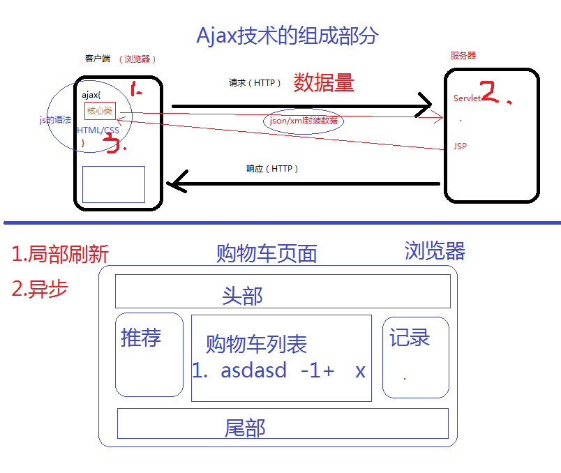
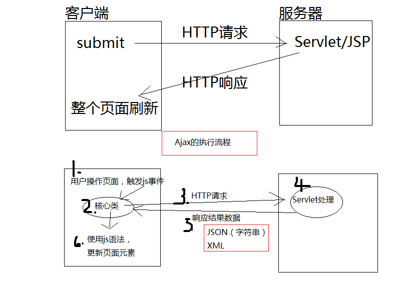

# Ajax

# 今日概要
	一、Ajax的概述
	二、Ajax的实践操作
	三、Ajax+json应用
	四、分页的实现（项目）

	前端技术
		HTML
		CSS
		JavaScript
		Ajax		

	后台数据
		Servlet
		JSP
		Filter
		Listener
		Oracle
	
# 一、Ajax的概述
#### <1>概念
	异步的JavaScript和XML技术
	不是新的编程语言，是几项技术的综合运用
				
### <2>组成
	涉及的技术：XMLHttpRequest,JavaScript,HTML,CSS,XML,JSON 等技术	XMLHttpRequest为核心，发送请求和接收响应结果数据
		以JavaScript语言为基础
		以XML,JSON作为数据传输格式
		动态的更改HTML元素和CSS样式		
	
	
### <3>优点
	异步请求和响应处理
	页面的局部刷新	
	
	使用页面局部刷新，减少了交互的数据量，提升了程序的性能，提升用户的体验感受
	以异步模式处理请求，减少了用户等待的时间，提高用户操作的连续性，提升用户的体验感受
	
### <4>工作流程
			

### <5>核心的API(XMLHttpRequest)(重点)
	1. 创建XMLHttpRequest对象
		注意浏览器的兼容性
	2. 调用open方法，创建一个ajax请求
		open(method,url,async)
			
	3. 设定onreadystatechange事件函数，用户处理响应结果
		判断响应结果是否成功的完成
			readyState属性：4
			status属性：200
		
		获取响应结果：
			responseText属性，获取字符串形式的响应数据
			responseXML属性，获取XML形式的响应数据

	4. 调用send方法，发送ajax请求
		send(String str)将请求发送至服务器
			String str:post方式，指定数据；get方式，指定null
			

	注意：使用ajax请求时，如果需要传递请求参数
		GET:
			获取的请求数据可能是缓存数据
			保证url的唯一性
			在url中添加一个唯一的标识
			xhr.open("get","url?时间",true);

		POST:
			使用setRequestHead()方法来添加HTTP头
			然后在send()方法时，在参数中指定字符串数据
		
# 练习
	使用Ajax发送一个请求，获取服务器的时间，并显示到前端页面的span标签中。
		
# 二、Ajax实践
	对购物车中的商品数量进行更改
	对购物车中的商品进行移除

# 三、Ajax+Json
### 在服务端将一个java对象转换成JSON字符串
	使用jar包
	
	JSONObject ：将单个java对象转换成json字符串
			JSONObject.fromObject(java对象).toString()
		
	JSONArray  ：将一个java集合转换成json字符串
			JSONArray.fromObject(java集合).toString()

### 在js中如何将一个JSON字符串转换成js对象		
	var obj = 使用eval("("  + json字符串 + ")");
	var obj  = JSON.parse("json字符串");

# 作业
	1. 完成购物的各种操作（删除商品和更改商品的数量）
	2. 使用Ajax方式展示商品列表
	    QueryProductServlet --->查询数据库获取商品信息---->ajax回调函数
							    数据格式的设定（JSON）

