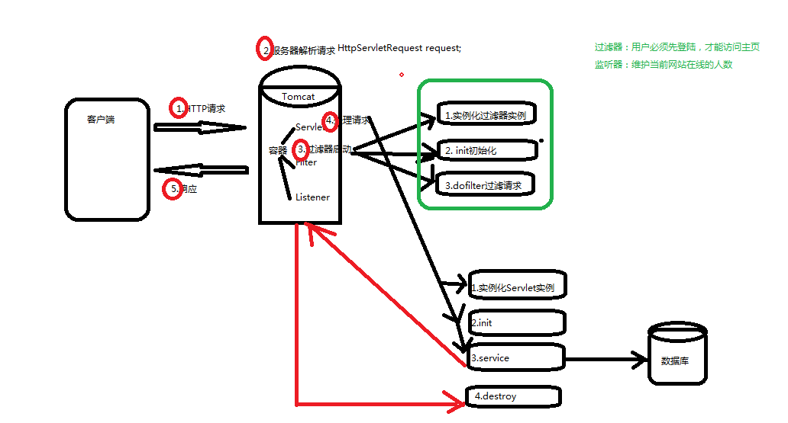

# WEB前端周测题

# 一．简答题。（每题5分共40分）

1.	什么是HTML，请简单写一个HTML？

    超文本标记语言。

        <!DOCTYPE html>
        <html>
        <head>
        	<title>test day</title>
        	
        </head>
        <body>
        	

        		
        	

        </body>
        </html>

2.	解析XML文档有哪些方式？分别是什么?

        1.sax解析
        2.dom解析
        3.JDOM解析
        4.DOM4J解析

3.	描述CSS框模型 

        CSS盒模型本质上是一个盒子，封装周围的HTML元素，它包括：边距，边框，填充，和实际内容。
        盒模型允许我们在其它元素和周围元素边框之间的空间放置元素。

4. 描述CSS三种定义方式 ,

        id、class、标签

5. CSS特性有哪些
        
        层叠性、继承性、优先级

6. 使用XML描述Person: 姓名高飞 , 年龄38岁 ,性别女 , id10002

    	<?xml version="1.0" encoding="UTF-8" ?> 
        <Person> 
            <name>高飞</name> 
            <age>38</age> 
            <femal>女</femal>
            <id>10002</id>
        </Person>

7. 描述行内元素, 行内块元素, 块元素的特性.

        行内元素不能设置宽高，
        行内块可以设置宽高，比行内元素层级高，比块元素低
        块元素基本属于最高的层级，相比较行内和块元素，通过设置 display 等于 block 可以把非块元素变成块元素

8. JS通过文档对象 获取元素对象的方法有几个? 分别是? 

        Document.getElementById
        Document.getElementsByTagName
        Document.getElementByClass

# 二．编码题（共4题52分）

1. 用CSS将如下span元素中的文本 , 模拟为超链接样式: (8分)
(变为:下划线, 蓝色文本,鼠标形状手指)

    	span:hidden{
    		text-decoration: underline;
    		color: blue;
    		cursor: pointer;
    	}
		
2.	要求做三个商品展示的模块，每个模块分为两个部分，上面是商品图片，下面是内容。每个商品模块中间有间距，并且每个模块具有阴影效果: (14分)

        <!DOCTYPE html>
        <html>
        <head>
        	<title>test day</title>
        	<meta name="name" content="content" charset="UTF-8">
        	
        </head>
        <body>
        	

        		

        		
XML Java课程案例

        	

        	

        		
 

        		
XML Java课程案例

        	

        	

        		

        		
XML Java课程案例

        	

        </body>
        </html>

3.	通过固定定位, 将如下div , 设置在浏览器的右下角.(10分)

        #div2{
        	width: 200px;
    		height: 200px;
    		background: red;
    		position: fixed;
    		right: 0;
			bottom: 0;
		}
    	

    		...
    	

4.	定义一个函数 , 用来计算两个数字的和, 并返回和; (12分)

        function my_sum(){
            var x = parseInt(document.getElementById("x").value);
        	var y = parseInt(document.getElementById("y").value);
        	var sum = 0;
        	sum = x+y;
        	document.getElementById("res").innerHTML = sum;
        	//console.log();
        }

5.编写界面题，界面需求如下:（16分）

    需求：
    某公司logo(图片)，
    用户名输入框， 验证符合手机号规则
    密码输入框，字母开头 由字母+数字 组成的8-32位字符
    性别单选框，与密码相同!
    爱好复选框，
    多行输入框(textArea)，
    登录按钮，
    重置按钮

    <!DOCTYPE html>
    <html>
    <head>
    	<title>test day</title>
    	<meta name="name" content="content" charset="UTF-8">
    	
    	
    </head>
    <body style="height: 1200px;"> 
    	
假装我是个官网

    	<form action="test_submit" method="get" accept-charset="utf-8" id="myform">
    		用户名：
    		<input type="numbel" name="tele" placeholder=" 请输入手机号" id="tele">
    		密码：
    		<input type="password" name="passwd" placeholder=" 请输入以字母开头的由字母和数字组成的8-32位字符的密码" id="passwd">
    		请选择您的性别： 
    		<input type="radio" name="women">女
    		<input type="radio" name="men" checked="checked">男
    		请选择您的爱好： 
    		<input type="checkbox" name="wangqiu">网球
    		<input type="checkbox" name="taiqiu">台球
    		<input type="checkbox" name="zuqiu">足球
    		备注： 
    		<textarea name="beizhu">
    		</textarea> 
    		

    			<button type="submit" onclick="login()">登录</button>
    			<button type="submit" onclick="form_reset()">重置</button>
    		
		
    	</form>
    </body>
    </html>

