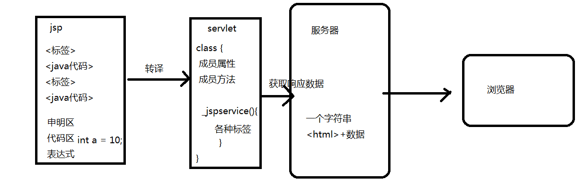

# JSP
---

# 今日概要
	一、初识JSP
	二、JSP语法结构
	三、内置对象
	

# 一、初识ＪＳＰ
### <1>概念
	JSP:Java Server Page,java 服务器 页面
	动态的生成HTML响应（写HTML标签的方式，CSS样式标签，JS标签）
	可以在HTML文件嵌入java程序和jsp标记，形成JSP文件（.jsp）
	本质上就是一个Servlet
	
### <2>特点
	HTML: JSP处理动态的内容	
	JavaScript: JSP可以和服务器交互，能够提供复杂的服务
	Servlet: JSP可以很方便编写或者修改HTML页面

	JSP可以开发跨平台的Web应用
	第一次请求JSP页面时，服务器将JSP页面转译成java代码，并编译成.class文件，最后直接调用.class生成HTML响应。
	后续的JSP请求，服务器会直接调用.class生成HTML响应。
	
# 二、JSP的语法（重点）
### <1>申明定义区（会被放置到转译的Servlet的成员位置）（重点）
	格式：
       <%!
			定义全局属性
			定义全局方法
		%>

	作用：在此申明全局变量和方法

### <2>java代码区（会被放置到转译的Servlet的_jspService()方法中）（重点）
	格式：
		<%
			任何java的代码
		%>		

	作用：编写任何的java代码

### <3>输出表达式（会被放置到转译的Servlet的_jspService()方法中）（重点）
	格式：
       <%= 表达式%>	
	
	注意：= 后面必须是字符串表达式，不需要添加;来表示结束，只有一行
		等价于：response.print(表达式);

# 练习
	编写jsp文件（修改编码格式）
	在页面中添加声明定义区，定义字符型变量dataStr和获取当前时间的方法getTime()
	在java代码区调用getTime()方法将结果赋值给dataStr	
	在输出表达式中输出结果

### <4>注释
	//单行注释
	/*多行注释*/

	<!--外部注释1 ，客户端可以查看-->
	<%--外部注释2--%>

### <5>指令和动作
	指定的语法格式：
		<%@指令名称 属性1=值1  属性2=值2  ... %>

##### 1. Page指令
	作用：描述并配置页面的配置信息和导包的操作
	
	语法格式：		<%@page import="java.text.SimpleDataFormat"%>
					<%@page import="java.util.Date"%>
					<%@page import="java.util.Date,java.text.SimpleDataFormat"%> 导入多个包

	<%@page  language=“java”		  |  语言（）
			extends=“className”       |  指定JSP生成时  继承的Servlet类     
			import=“importList”       |  导包（）
			buffer=“none|kb  size”    |  缓冲区
			session=“true|false”      |  是否启动seesion  
			autoFlush=“true|false”    |  是否自动刷新
			isThreadSafe=“true|false” |	 线程是否安全 
			errorPage=“errorPageUrl”  |  错误的页面（）
			isErrorPage=“true|false”  |  是否是处理错误的页面（）
			contentType=“contentTyepInfo” | 描述当前页面的内容类型和编码格式（）
	%>
	
##### 2.taglib指令
	作用：扩展JSP程序的标签元素，引入其他功能的标签库文件。

	语法格式：<%@taglib uri="tabLibary" prefix="prefix"%>

	(最终的jsp页面中，尽量少使用java代码，将if/for等功能，使用标签的方式来实现)

##### 3. include指令
	作用：引入另一个JSP程序或者HTML文件等,将复杂的页面模块化处理
	
	语法格式：<%@include file="fileURL"%>
	
##### 4. include动作
	语法格式：
		<jsp:include page="跳转的页面"/>	
	
		<jsp:include page="跳转的页面">
			<jsp:param value="v" name="k"/>		
		</jsp:include>	

##### 5. forward动作	
	语法格式：
		<jsp:forward page="跳转的页面"/>	
	
		<jsp:forward page="跳转的页面">
			<jsp:param value="v" name="k"/>		
		</jsp:forward>	
	
# 练习
	使用转发动作<jsp:forward page="跳转的页面">实现登陆验证后的页面跳转
	
	login.jsp登陆页面
		表单数据提交到：checklogin.jsp
	checklogin.jsp验证登陆页面
		验证表单提交的数据，跳转success.jsp登陆成功页面，
		或者跳回login.jsp登陆页面
	success.jsp登陆成功页面
		接收checklogin.jsp验证页面传递的用户名，并提示用户登陆成功
	
	
# 作业
	完善最后一个显示商品信息的案例
		
	数据表：xdl_product，包含字段(可以选择几个字段来创建表)
		create table xdl_product(
		    product_id  NUMBER,
		    name    VARCHAR2(50),
		    keywords    VARCHAR2(50),
		    add_time    DATE,
		    picture VARCHAR2(50),
		    big_picture VARCHAR2(50),
		    fixed_price NUMBER,
		    lower_price NUMBER,
		    description VARCHAR2(100),
		    author  VARCHAR2(100),
		    publishing  VARCHAR2(100),
		    publish_time    DATE,
		    isbn    VARCHAR2(100),
		    language    VARCHAR2(100),
		    which_edtion    VARCHAR2(100),
		    total_page  VARCHAR2(100),
		    bind_layout VARCHAR2(100),
		    book_size   VARCHAR2(100),
		    editor_description  VARCHAR2(100),
		    catalog VARCHAR2(100),
		    book_summary    VARCHAR2(100),
		    author_summary  VARCHAR2(100),
		    extracts    VARCHAR2(100),
		    print_time  DATE,
		    print_number    NUMBER,
		    paper_type  VARCHAR2(100),
		    print_frequency VARCHAR2(100),
		    sale_count number  //添加销售量字段
		);
			 
	流程：
		客户请求（展示商品信息）---->Servlet处理请求（数据库数据的读取操作）----->(转发：页面的跳转和数据的传递)---->show_products.jsp(数据的展示)
									Dao
									DaoImp																		<html><%java代码%></html>		
									Factory																		css样式
									Service																		js的事件处理
									Product
				
									DBUtil
									Properties
									显示（拼HTML元素）
									

