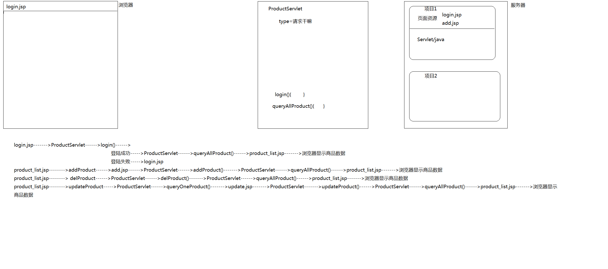

# JSP

# 回顾
	一、JSP概述
	二、JSP语法
		申明定义区
		java代码区      _jspservice()
		输出表达式
		
		指定：include  /   page   /   taglib
		
# 今日概述
	一、JSP内置对象
	二、MVC设计思路
	

# 一、JSP内置对象

	输入输出对象：out对象，response对象，request对象
	通信控制对象：application对象，session对象，pageContext对象
	错误处理对象：exception对象
	Servlet对象：page对象，config对象

### <1>out对象
	概念：输出流对象，用来向浏览器输出信息。
		  还负责对缓冲区进行管理
	
	常用方法：print或者println,输出信息

### <2>request对象
	概念：封装了从客户端到服务器发出的请求信息。		
	
	
	常用方法：getParameter方法，接收服务器得到浏览器通过get/post方式传输的数据
			 setAttribute/getAttribute方法，用于在web组件之间进行数据的共享（servlet/jsp）
			 getRequestDispatcher("out.jsp").forward(request, response),页面的跳转

### <3>response对象
	概念：用户对客户端的请求进行回应。

	常用方法：sendRedirect,把响应发送到另一个位置进行处理
			 getWriter,输出信息

### <4>application对象(ServletContext)
	概念：代表当前应用程序的上下文，可以在不同的用户之间共享数据。
	
	常用方法：setAttribute/getAttribute ,用于在不同的用户之间共享信息

# 练习
	使用application对象实现对某个网站访问量的记录

### <5>session对象(HttpSession，存储用户信息/购物车信息等等)
	概念：用于保存用户的会话信息，实现一个用户的不同请求之间的数据共享。

	常用方法：setAttribute/getAttribute,同一个用户的不同请求之间的数据交互

	ProductServlet----->product_list.jsp----->购买(获取商品的信息)----->CarServlet(id,保存购物车数据)----->product_car.jsp
																			session(保存数据)
																			application
																			request		

# 作业
	完成课上的Demo（完成）
	扩展购物车功能
	完善代码（Dao）
			表------>dao---->daoimp---->daofactory---->daoservice

			xdl_product
			xdl_user

	预习EL+JSTL
		jsp  前端显示

