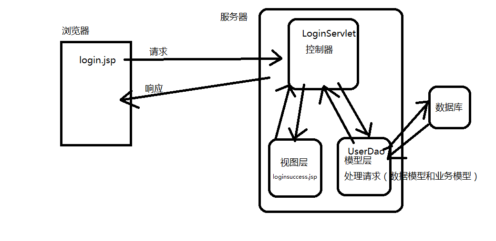

# JSP
		
# 今日概述
	一、JavaBean对象
	二、MVC设计思路
	三、EL、JSTL
	

# 一、JavaBean对象

### 概念	
	java类，遵循了java api规范

	提供一个无参的构造方法
	被序列化实现相关接口
	可以多个的属性
	可以多个操作属性的方法，set/get

### 作用
	封装数据：实体bean
	封装业务 : 逻辑bean 

### jsp访问javabean
	语法格式：创建一个bean对象
		<jsp:useBean 
			id ="存储在jsp中的对象的key"
			class="包名+类名"
		>
		</jsp:useBean>

	设置属性值：name属性，指定的bean对象的id值；property,设置或者获取的属性名称

		<jsp:useBean 
			id ="存储在jsp中的对象的key"
			class="包名+类名">
			<jsp:setProperty  name="对象的唯一标识"  property="设置值属性名称" value="设置属性的值"/>
		</jsp:useBean>
		
	获取属性值：
		<jsp:getProperty  name="对象的唯一标识"  property="设置值属性名称"/>

# 二、MVC
	MVC模型将程序组件按照职责的不同划分为以下三部分：
	
	M,模型组件，数据和业务组成
	V,视图组件，和用户交互的（Jsp文件）
	C,控制器组件，协调M和V，处理用户的请求（Sevlet）

	流程：
		将视图层的请求发送给控制器	，控制器调用模型层处理请求，
		控制器根据结果，调用视图来展示响应结果。
	
	浏览器发送一个请求-------->服务器接收请求并处理
	浏览器发送一个请求-------->控制器------->调用模型层------>视图层------>响应到浏览器
	登陆：遵循的一套流程
		浏览器发送一个登陆的请求login.jsp----->LoginServlet----->UserDao----->loginsuccess.jsp/login.jsp
		浏览器发送一个登陆的请求register.jsp----->RegisterServlet----->UserDao----->registersuccess.jsp/register.jsp
	
	

# 三、EL+JSTL
	
### EL
		
### <1>概念

	以表达式的方式快速的从域对象中获取信息，并输出至网页
	
### <2>作用

	1. 获取域对象中的数据（pageContext,request,session,application）
	2. 访问对象中的属性
	3. 输出简单的运算结果
	4. 获取请求的参数

### <3>特点

	从小范围到大范围，获取域对象中的数据
		先从pageContext中查找，存在则输出数据，
		从request中查找，存在则输出数据，
		从session中查找，存在则输出数据，
		从application中查找，存在则输出数据，
		都未查找到结果，则输出null值

	从域对象中根据一个键只获取一个值

### <4>语法格式(重点)

	${key} 从域对象中获取数据
	${作用域标识符.key} 指定从某个域对象中获取数据
	${param.key} 获取请求参数对象

	获取对象的属性：
		${ObjectKey.属性}
		${ObjectKey["属性"]} 	

	获取集合/数组中的对象
		${集合对象key[下标].属性}
		${集合对象key[下标]["属性"]}

# 作业

	完成课上的Demo（完成）
	扩展购物车功能
	完善代码（Dao）
			表------>dao---->daoimp---->daofactory---->daoservice

			xdl_product
			xdl_user

	预习EL+JSTL
		jsp  前端显示

# 作业2

	1. 完善demo
	
	2. 重构代码，显示数据时，使用el表达式来完成
		for(){
			将当前要显示的对象放置到域对象中			

			<h1>el表达式.属性<h1>
		}

	

